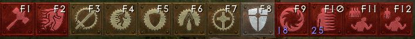
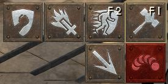
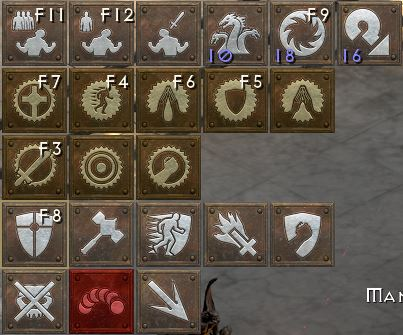

## Hotkey Macros
- ```Left Click``` Assigned auto-aura
- ```Left Click + Right Click``` Charge
- ```Thumb Click 1``` Toggle through and set Primary or Secondary Aura as Assigned auto-aura
- ```Thumb Click 2``` Toggle through and set Tertiary Aura or Redemption as assigned Auto-aura
- ```Space down``` Concentration (set spacebar as second stand-still action in key-mappings)
- ```Space up``` Redemption
- ```E``` - Town Portal
- ```W``` - Buffs (Holy Shield and/or Battle Command + Battle Orders)
- ```Moue wheel up``` Heal merc from potion column 1
- ```Moue wheel dopwn``` Heal merc from potion column 2
- ```Escape``` Quick exits if  hardcoreCharter variable set to true
- ```Shift + Esc``` Quick restart hell game
- ```Shift + Enter``` Quick start hell game from character screen

## Skill Assignments


### Left Click
- ```F1``` Holy Hammers
- ```F2``` Charge



### Right Click
- ```F3``` Concentration
- ```F4``` Primary Aura
- ```F5``` Secondary Aura
- ```F6``` Tertiary Aura
- ```F7``` Redemption
- ```F8``` Holy Shield
- ```F9``` Town Portal
- ```F10``` Item Teleport
- ```F11``` Battle Command
- ```F12``` Battle Orders



